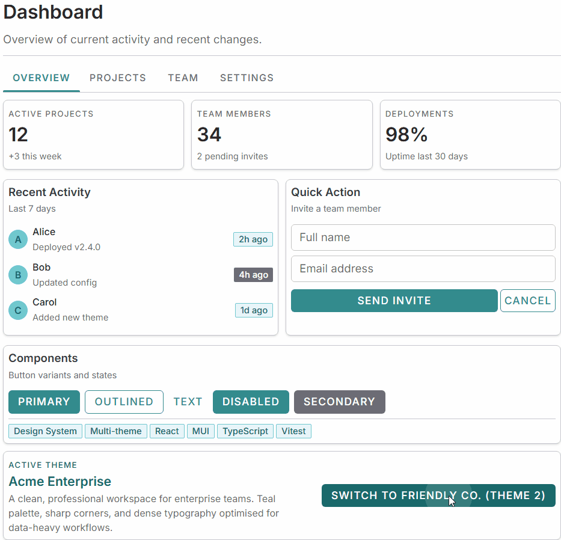
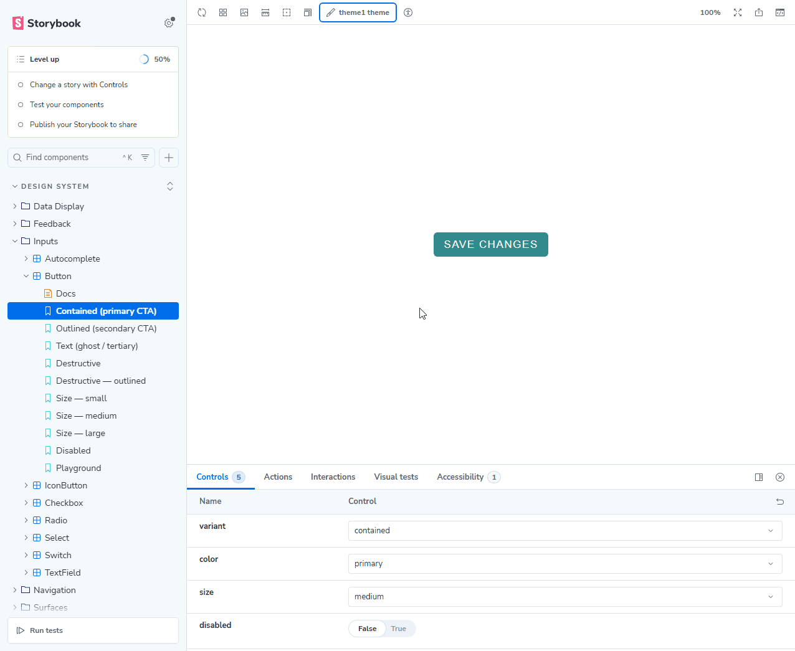

# Themiq

A multi-theme React platform built with MUI, Vite, and TypeScript. The theme is selected at runtime via a pluggable resolver system — the same codebase serves multiple applications, each with its own visual identity.

---

## Table of Contents

- [Tech stack](#tech-stack)
- [Getting started](#getting-started)
- [Available scripts](#available-scripts)
- [Project structure](#project-structure)
- [Architecture overview](#architecture-overview)
- [Theming system](#theming-system)
- [Design system](#design-system)
- [Path aliases](#path-aliases)
- [Adding a new page / route](#adding-a-new-page--route)

---

## Tech stack

| Concern            | Library                                                                  |
| ------------------ | ------------------------------------------------------------------------ |
| UI framework       | [React 19](https://react.dev/)                                           |
| Component library  | [MUI v7](https://mui.com/)                                               |
| Styling engine     | [Emotion](https://emotion.sh/) + [tss-react](https://www.tss-react.dev/) |
| Routing            | [React Router v7](https://reactrouter.com/)                              |
| Build tool         | [Vite](https://vite.dev/)                                                |
| Language           | TypeScript (strict mode)                                                 |
| Testing            | [Vitest](https://vitest.dev/)                                            |
| Component explorer | [Storybook](https://storybook.js.org/)                                   |
| Utility            | [Ramda](https://ramdajs.com/)                                            |

---

## Getting started

```bash
# Install dependencies
npm install

# Start the dev server (http://localhost:5173)
npm run dev
```

---

## Available scripts

| Script                    | Description                                    |
| ------------------------- | ---------------------------------------------- |
| `npm run dev`             | Start the Vite dev server                      |
| `npm run build`           | Production build                               |
| `npm run preview`         | Preview the production build locally           |
| `npm run typecheck`       | Run TypeScript type-check (app + node configs) |
| `npm run lint`            | Run ESLint across all source files             |
| `npm run lint:fix`        | Auto-fix ESLint issues (incl. import order)    |
| `npm test`                | Run Vitest unit tests                          |
| `npm run storybook`       | Start Storybook on port 6006                   |
| `npm run storybook:dev`   | Run Storybook + Vitest concurrently            |
| `npm run build-storybook` | Build static Storybook output                  |

---

## Project structure

```
src/
├── main.tsx                  # App entry point — BrowserRouter + StrictMode
├── App.tsx                   # Root component — wraps routes in PlatformTheme
├── index.css                 # Minimal global fallback styles (box-sizing, margins)
│
├── design-system/            # Reusable themed UI components
│   ├── DataDisplay/          # Badge, Chip, DataGrid, Divider, Icon, List, Tooltip, Typography, …
│   ├── Feedback/             # Alert, CircularProgress, Dialog, Skeleton, Snackbar
│   ├── Inputs/               # Autocomplete, Button, Checkbox, Form, Radio, Select, Switch, TextField
│   ├── Layout/               # Box
│   ├── Navigation/           # Breadcrumbs, Drawer, Link, Menu, Tabs
│   ├── Surfaces/             # Accordion, Card, Paper
│   ├── svgs/                 # Raw SVG components and shared Svg wrapper
│   ├── utils/                # createStyles, makeStyles
│   └── index.ts              # Single barrel — import everything from '@/design-system'
│
├── theming/                  # Theme selection, spec contracts, and MUI integration
│   ├── PlatformTheme.tsx     # Root MUI ThemeProvider — calls the active resolver
│   ├── config.ts             # (deprecated) URL-slug resolver — moved to resolvers/
│   ├── resolvers/            # Pluggable theme-selection strategies
│   │   ├── index.ts          # ← EDIT THIS FILE to change the active strategy
   │   │   ├── urlSlug.ts        # URL first-path-segment strategy
   │   │   └── types.ts          # UseThemeResolver contract
   │   │   # More resolver types available in Themiq Pro
│   ├── themes/               # Theme implementations
│   │   ├── spec/             # TypeScript contracts (ThemeSpec and sub-types)
│   │   ├── theme1/           # Theme 1 implementation
│   │   ├── theme2/           # Theme 2 implementation
│   │   └── types.d.ts        # MUI module augmentation (Shape, BreakpointOverrides)
│   └── utils.ts/             # getTheme (ThemeSpec → MUI Theme), createShadows
│
├── hooks/                    # Shared React hooks
│   ├── useCheckOverflowOnHover.ts
│   └── useMergedRef.ts
│
├── pages/                    # Route-level page components
│   └── Main.tsx
│
└── validations/              # Pure validation utilities
    └── isValidURL.ts
```

---

## Architecture overview

```
main.tsx
  └── BrowserRouter
        └── App.tsx
              └── PlatformTheme          ← resolves theme name via resolver hook
                    └── MUI ThemeProvider (active MUI Theme object)
                          └── Routes / pages
```

The theme is resolved by a **resolver hook** (`src/theming/resolvers/index.ts`). The resolver is swappable without touching any other file — see [Theming system](#theming-system).

---

## Theming system

See [`src/theming/README.md`](src/theming/README.md) for the complete guide.

**Quick start — change the active strategy:**

Open `src/theming/resolvers/index.ts` and swap the import + factory call. That is the only file that needs to change.

This template includes the **URL slug** resolver. It selects a theme from the first URL path segment — e.g. `/theme1-app/` activates `theme1`.

> **Need a different strategy?** 11 additional resolvers are available in **[Themiq Pro](https://themiq.io/pro)**.

**Add a new theme:**

1. Create `src/theming/themes/my-theme/` following the same file structure as `theme1/`
2. Export it from `src/theming/themes/index.ts`
3. Add `"my-theme"` to the `name` and `designSystem` unions in `src/theming/themes/spec/index.ts`
4. Register it in the resolver configuration in `src/theming/resolvers/index.ts`

---

## Design system

See [`src/design-system/README.md`](src/design-system/README.md) for the component catalogue and authoring guide.

**Importing components:**

```ts
import { Button, Typography, Alert, createStyles } from "@/design-system";
```

All components, form parts, and styling utilities are exported from the single barrel at `src/design-system/index.ts`.

---

## Path aliases

| Alias               | Resolves to           |
| ------------------- | --------------------- |
| `@/design-system`   | `src/design-system`   |
| `@/design-system/*` | `src/design-system/*` |

Configured in both `tsconfig.app.json` (for TypeScript) and `vite.config.ts` (for the bundler).

---

## Adding a new page / route

1. Create `src/pages/MyPage.tsx`
2. Add a `<Route>` inside the `<Routes>` in `src/App.tsx`:
   ```tsx
   import MyPage from "./pages/MyPage";
   <Route path="/my-path" element={<MyPage />} />;
   ```
3. Use components from `@/design-system` inside the page

---

## Live demo

This template includes two fully styled themes and a demo page. Run `npm run dev` and open the URLs below to see them side-by-side:

| URL                                 | Theme                                                |
| ----------------------------------- | ---------------------------------------------------- |
| `http://localhost:5173/theme1-app/` | **Theme 1 — Acme Enterprise** (teal, sharp, Inter)   |
| `http://localhost:5173/theme2-app/` | **Theme 2 — Friendly Co.** (purple, rounded, Nunito) |

A **Switch Theme** button is embedded in the demo page for one-click comparison.

**Demo page — live theme switch:**



**Storybook — theme switcher in action:**



### What makes the themes visually distinct

| Token                           | Theme 1 (Professional) | Theme 2 (Friendly)      |
| ------------------------------- | ---------------------- | ----------------------- |
| Primary color                   | Teal `#338B8D`         | Purple `#7247B4`        |
| Secondary color                 | Stone grey             | Plum magenta            |
| Page background                 | Pure white             | Soft lavender `#F7F1FF` |
| Header/sidebar (`neutral-dark`) | Dark grey `#3D3D3D`    | Deep purple `#593099`   |
| Border radius (base)            | 6 px (sharp)           | 12 px (rounded)         |
| Font family                     | Inter                  | Nunito / Poppins        |
| Heading weight                  | 600 (semi-bold)        | 700 (bold)              |

### Completed milestones (`showcase`)

- ✅ 57 MUI component wrappers with token-driven styles (`createStyles`)
- ✅ Both themes styled with real palette, shape, and typography tokens
- ✅ Storybook theme switcher fixed (`withThemeFromJSXProvider` typed correctly)
- ✅ All 23 story files use correct MUI prop values + `meta.args` defaults for instant previews
- ✅ `DemoPage` is theme-aware: shows brand name, tagline, and description per active theme
- ✅ Live theme switcher embedded in the demo page (`/theme1-app/` ↔ `/theme2-app/`)
